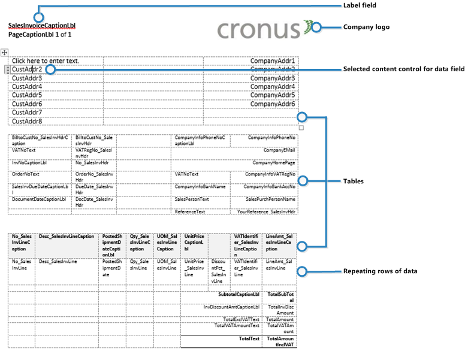

# Gestion des présentations de rapport et de document
Une présentation de rapport contrôle le contenu et le format du rapport, dont les champs de données d'un ensemble de données de rapport apparaissant sur le rapport et la façon ils sont organisés, le style de texte, les images, et plus encore. À partir de [!INCLUDE[d365fin](includes/d365fin_md.md)], vous pouvez modifier la présentation utilisée sur un rapport, créer une nouvelle présentation ou modifier les présentations existantes.

> [!NOTE]  
>   Dans [!INCLUDE[d365fin](includes/d365fin_md.md)], le terme « état » couvre également les documents externes, tels que les factures vente et les confirmations de commande que vous envoyez à des clients comme fichiers PDF.

En particulier, une présentation de rapport configure ce qui suit :

* Les champs d'étiquette et de données à inclure à partir de l'ensemble des données du rapport [!INCLUDE[d365fin](includes/d365fin_md.md)].
* Le format du texte, comme le type, la taille et la couleur de police.
* Le logo de la société et son emplacement.
* Paramètres de page généraux, comme les marges et les images d'arrière-plan.

Un [!INCLUDE[d365fin](includes/d365fin_md.md)] peut être créé avec plusieurs présentations de rapport, que vous pouvez ensuite changer au besoin. Vous pouvez utiliser l'une des présentations d'état intégrées ou vous pouvez créer des présentations d'état personnalisées et les affecter à vos états selon vos besoins. Pour plus d'informations, voir [Procédure : créer une présentation de rapport ou de document personnalisée](ui-how-create-custom-report-layout.md).

Il existe deux types de présentations que vous pouvez utiliser pour les états : Word et RDLC.

## Aperçu de la présentation d'état Word
Une présentation de rapport Word est basé sur un document Word (type de fichier .docx). Les présentations d'état Word vous permettent de concevoir des présentations d'état à l'aide de Microsoft Word 2013 ou une version ultérieure. Une présentation d'état Word détermine le contenu de l'état, contrôle la manière dont les éléments de contenu sont organisés ainsi que leur apparence. Un document de présentation de rapport Word utilisera généralement des tableaux pour organiser le contenu, dans lequel les cellules peuvent contenir des champs de données, du texte ou des images.

   

## Aperçu de la présentation RDLC
Les présentations RDLC sont basées sur les présentations de définition de rapport client (types de fichier .rdlc or .rdl). Ces présentations sont créées et modifiées à l'aide du Générateur de rapports SQL Server. Le concept des présentations RDLC est similaire à celui des présentations Word, où la présentation définit le format général de l'état et détermine les champs de l'ensemble de données à inclure. La création de présentations RDLC est plus avancée que les présentations Word. Pour plus d'informations, voir [Création de présentations de rapport RDLC](https://msdn.microsoft.com/en-us/dynamics-nav/designing-rdlc-report-layouts).

## Présentations d'état intégrées et personnalisées
[!INCLUDE[d365fin](includes/d365fin_md.md)] inclut plusieurs présentations intégrées. Les présentations intégrées sont des présentations prédéfinies conçues pour des états spécifiques. [!INCLUDE[d365fin](includes/d365fin_md.md)]les états comportent une présentation intégrée, RDLC, Word et parfois les deux. Vous ne pouvez pas modifier une présentation d'état intégrée à [!INCLUDE[d365fin](includes/d365fin_md.md)], mais vous pouvez les utilisez comme point de départ pour l'élaboration de vos propres présentations d'état personnalisées.

Les présentations personnalisées sont des présentations de rapport que vous créez pour modifier l'apparence d'un rapport. Vous créez généralement une présentation personnalisée basée sur une présentation intégrée, mais vous pouvez les créer de A à Z ou à partir d'une copie d'une présentation personnalisée existante. Les présentations personnalisées vous permettent d'avoir plusieurs présentations pour le même rapport, que vous choisissez en fonction de vos besoins. Par exemple, vous pouvez avoir différentes présentations pour chaque société [!INCLUDE[d365fin](includes/d365fin_md.md)] ou vous pouvez avoir plusieurs présentations pour la même société pour des occasions ou événements spécifiques, comme une campagne spéciale ou la période des fêtes.

## Décider d'utiliser une présentation d'état Word ou RDLC
Une présentation de rapport peut être basée sur un document Word ou un fichier RDLC. Le choix entre une présentation de rapport Word ou une présentation de rapport RDLC dépendra de la façon dont vous souhaitez que le rapport généré apparaisse et de vos connaissances sur Word et SQL Server Report Builder.

Les concepts généraux pour les présentations Word et RDLC sont très similaires. Cependant, la conception de chaque type présente certaines fonctionnalités qui affectent la manière dont l'état généré s'affiche dans [!INCLUDE[d365fin](includes/d365fin_md.md)]. Cela signifie que le même rapport peut sembler différent selon que vous utilisez une présentation de rapport Word ou une présentation de rapport RDLC.

Le procédure pour paramétrer des présentations de rapport Word et des présentations de rapport RDLC sur les rapports est la même. La principale différence réside dans la manière dont vous modifiez les présentations. Il est souvent plus facile de créer et de modifier des présentations de rapport Word que des présentations de rapport RDLC car vous pouvez utiliser Word. Les présentations de rapport RDLC sont modifiées à l'aide de SQL Server Report builder qui cible plus d'utilisateurs avancés.

Pour plus d'informations sur la manière d'utiliser l'une ou l'autre présentation, reportez-vous à [Procédure : modifier la présentation actuellement utilisée sur un rapport](ui-how-change-layout-currently-used-report.md).

## Voir aussi
[Mise à jour des présentations de rapport ou de document](ui-update-report-layouts.md)  
[Utilisation de [!INCLUDE[d365fin](includes/d365fin_md.md)]](ui-work-product.md)  
[Procédure : créer et modifier une présentation de rapport ou de document personnalisée](ui-how-create-custom-report-layout.md)  
[Procédure : importer et exporter une présentation de rapport ou de document personnalisée](ui-how-import-and-export-report-layout.md)  
[Procédure : envoyer des documents par e-mail](ui-how-send-documents-email.md)  
[Utilisation des états](ui-work-report.md)  

